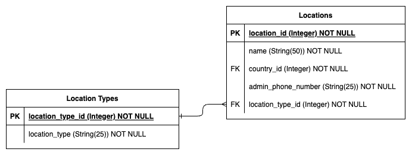

# T2A2 - API Webserver Project

### Kiran Warren

## Fabrication Project Catalogue API

## Contents

- [1 Project Description](README.md#1-project-description-r1-r2)
  - [1.1 RDBMS Chosen - Postgres](README.md#11-rdbms-chosen---postgres-r3)
  - [1.2 ORM Chosen - SQLAlchemy](README.md#12-orm-chosen---sqlalchemy-r4)
- [2 Database Design](README.md#2-database-design)
  - [2.1 Entity Relation Diagram](README.md#21-entity-relation-diagram-r6)
  - [2.2 Data Tables](README.md#22-data-tables)
  - [2.3 Relationships](README.md#23-relationships-r8)
  - [2.4 Flask Relationships](./README.md#24-flask-relationships-r9)
- [3 Application Design](README.md#3-application-design)
  - [3.1 API Endpoints](README.md#31-api-endpoints-r5)
    - [3.1.1 Homepage](/README.md#311-homepage)
    - [3.1.2 Authentication](/README.md#312-authentication)
    - [3.1.3 Users](/README.md#313-users)
    - [3.1.4 Locations](/README.md#314-locations)
    - [3.1.5 Comments](/README.md#315-comments)
    - [3.1.6 Projects](/README.md#316-projects)
    - [3.1.7 Manufactures](/README.md#317-manufactures)
    - [3.1.8 Drawings](/README.md#318-drawings)
    - [3.1.9 Countries](/README.md#319-countries)
    - [3.1.10 Location Types](/README.md#3110-location-types)
    - [3.1.11 Currencies](/README.md#3111-currencies)
  - [3.2 Third-Party Sevices](README.md#32-third-party-services-r7)
- [4 Project Management](README.md#4-project-management)
  - [4.1 Git Repository](./README.md#41-git-repository)
  - [4.2 Project Management Tool](./README.md#42-project-management-tool-r10)

## 1 Project Description (R1, R2)

The topic chosen for this assignment is an API webserver designed to store and display information relating to a business' fabrication capabilities. This comes from personal experience working in an organisation with many locations of business, with each location having different a purpose and varying functionalities. Some locations are support offices, others are support workshops, some of rehabilitation projects, and most are mine sites. Operations are also multinational, with locations across Australia, Indonesia, Chile, India, Canada and the US.

Different locations are naturally siloed to some extent, and it is not possible to know what engineering projects have been completed at other locations without aimlessly calling/emailing around to contacts around the business. The aim of this project is to provide a platform to facilitate information sharing between locations. Fabrication projects will be catalogued in this database, and users will be able to see what projects have been designed internally and what workshops offer to fabricate them. For this application, a fabrication project would refer to a fabricated solution to a problem designed by an engineer, e.g. a transport frame, or a lifting tool, or a bespoke work platform, etc. Some example uses for this application include:

- A team of asset specialists working on a scope to deploy 12 x new CAT 789C trucks to a mine site. These trucks will need consist works completed before they can be handed over to operations. This application will provide a quick solution to see what consist has been designed internally. They can also see which internal workshops are willing to fabricate these projects, so they can contact them ahead of time and get the projects in the works before the trucks arrive. Price estimates for the consist work are provided, allowing the team of asset specialists to add these figures to the fleet mobilisation budget.
- A maintenance superintendent has a failed CAT 793D transmission on his hands and needs to send it offsite for repair, however, his mine site does not have any transport frames that are certified to transport the 2 tonne component. By searching the available projects in this application, the superintendent sees that a support workshop has designed a certified transport frame for this purpose. She can retrieve all of the associated drawing numbers for this project and request them from the contact at the support workshop. She gives the drawings to a local engineering shop to have the frame fabricated.
- An engineer at a support workshop has been tasked with designing a tool to help install CAT 777F rear wheel groups. Before starting the project, the engineer quickly checks the application to see if this problem has already been solved elsewhere in the business. They see that an Indonesian workshop has done just that, so they request all associated drawings for this project from the Indonesian workshop. No time is wasted designing a tool that has already been designed elsewhere in the company.

The information sharing provided by this application would save time and resources. Operational workers on mine sites would be given a clearer picture of what is internally available and who can make it for them. Engineers tasked with designing projects could utilise solutions that have been designed elsewhere in the business, instead of wasting time reinventing the wheel. It would work towards breaking down the information siloing between locations and pool the resources of the entire organisation. Additionally, it would help keep money in the business--why pay a third party $36,000 to design and fabricate something when you can see that a sister workshop has already designed a solution to your problem, and offer to build it for only $12,500?

The aim of this project is to provide personnel of a business an overview of the internal design and fabrication capabilities across the business. The application will need to provide users details of all of the engineering projects that have been designed. It will also need to provide a "catalogue" of sorts, where various business locations can offer to fabricate said engineering projects for other internal locations at an estimated price. Users should also be able to discuss the engineering design projects with other users, by posting comments and viewing other people's comments.

### 1.1 RDBMS Chosen - Postgres (R3)

This project will use a relational database to store all information relating to the fabrication projects. The relational database management system that will be used is PostgreSQL. The reasons for choosing this RDBMS over others include:

- Postgres is open source. It is free for a business to use and modify this DBMS. This provides a reduction in operating costs compared to paid-for solutions.
- Postgres supports an inordinate number of data types. This may come in handy later, if complex attributes need to be added to models.
- Postgres is compatible with many platforms. This should help mitigate any compatibility issues, especially when combined with stringent IT procurement rules across the business.
- Postgres is widely used and well supported by developer communities.
- Postgres supports concurrency control. This application may have many admins working to update and add information simultaneously. Concurrency control allows for multiple users to perform database transactions simultaneously without causing integrity issues.
- Postgres is highly scalable, allowing it to handle high amounts of data and users.

Some of the downsides to using PostgreSQL include:

- Postgres has a comparatively lower read speed than other DBMSs, such as MySQL.
- Postgres is not owned by a single entity and there is no centralised, official help centre.

### 1.2 ORM Chosen - SQLAlchemy (R4)

SQLAlchemy is an Object-Relational Mapper that automates the transfer of data between the PostgreSQL database management system and Python objects. It acts as a bridge between the database and the Python code. Instead of needing to write SQL statements to create/read/update/delete data in the database, Python code can be used instead. This makes it much easier to develop an API webserver, particularly for a beginner, where everything can just be written in the one programming language (Python in this case).

In a Flask app, working with the database becomes very easy through use of SQLAlchemy. Instead of using SQL database statement, queries and transactions can be written in a Pythonic manner. For example, to retrieve all entries from a table and store them in an object to be used programmatically, the following lines of Python code can be used:

> query = database.select("Model")

> object = database.session.scalars(query)

As another example, insertions are also very easy and can be performed using Python. Creating a new entry in a dictionary table can be performed using the following:

> new_entry = Model(\*\*object)

> database.session.add(new_entry)

> database.session.commit()

This allows us to use the json body from PUT requests to add new entries to tables. The json must be mapped to a new entry using the relevant model, then the entry can be added to table.

## 2 Database Design

### 2.1 Entity Relation Diagram (R6)

### 2.2 Data Tables

The database will have the following 9 data tables outlined below. If a primary key is not described, a sequential ID column will be used to uniquely identify each entry.

- <b>Locations</b> - This table will store information regarding business locations. For normalisation, two supporting tables have been created for the Locations table; Countries and Location Types. The locations table will store the following attributes:
  - name: The name of the business location.
  - country_id (Foreign Key): The ID of a corresponding country in the Countries table.
  - admin_phone_number: A phone number to be used as a general contact number for the business location.
  - location_type_id (Foreign Key): The ID of a correspondoing location type in the Location Types table.
- <b>Countries</b> - List of the countries where business locations are situated. This will store a single attribute:
  - country: The name of the country.
- <b>Location Types</b> - List of location types that business locations may be. This will store a single attribute:
  - location_type: The type of location, e.g., head office, mine site, regional support office, fabrication workshop, etc.
- <b>Users</b> - This table will store information on all users of the API webserver. The attributes to be stored include:
  - username: The username of the user, preferably based on the real name of the user.
  - email_address: The business email address of the user.
  - location_id (Foreign Key): The ID of a business location that this user is employed to work at.
  - position: The user's position, e.g. mechanical engineer, maintenance supervisor, administrative assistant, etc.
  - is_admin: A stored boolean value (True/False) that flags whether this user is an admin of the webserver application.
  - password: The user's password for authentication purposes. To be stored in the database in an encrypted form using the Bcrypt module.
- <b>Projects</b> - This table will store information on engineering design projects. The following attributes will be stored:
  - title: The title or general description of the design project.
  - published_date: The data that the project was first published or released for manufacture.
  - description: An extended description of the project. No restrictions on the information this field may contain.
  - certification_number: A field to store the certification number received from the third party engineering consultancy employed to certify the design project to the relevant standards.
- <b>Drawings</b> - This table will store information on all drawings relating to design projects. A project will typically contain many drawings, so each drawing will need to be linked to a particular project. The attributes to be stored are:
  - drawing_number: The main identifier for the drawing outside of the database.
  - project_id (Foreign Key): The ID of the associated design project that this drawing is a part of.
  - part_description: An optional description of what is contained in the drawing, e.g. general assembly, framework, plate, etc.
  - version: The released version of the drawing following updates, corrections & changes.
  - last_modified: An automated column that stores the datetime that the entry was last added or modified.
- <b>Comments</b> - This table will store comments that users have made on projects. Many users could comment on many projects, so the Comments junction table has been created to simplify the many-to-many relationship. A single comment will need to reference the user that made the comment and the project that is being commented on. The attributes to be stored are:
  - project_id (Foreign Key): The ID of a design project that this comment relates to.
  - user_id (Foreign Key): The ID of the user that made this comment.
  - comment: The comment itself.
  - when_created: An automated datetime column that stores the datetime that the comment was inserted into the comments table. Cannot be changed.
  - last_edited: An automated datetime column that stores the datetime when the comment was last edited by either the user that made the comment or an admin.
- <b>Manufactures</b> - This table will store information regarding what locations can manufacture which projects. Think of this table as the fabrication catalogue for the company. One row of this table represents a location offering to manufacture a project for an estimated price. Many locations could manufacture many projects, so the Manufactures junction table was created to resolve this. There should be no duplication of rows containing the same location and project information, so a composite key will be used to ensure unique combinations of location-project. For normalisation, a single supporting table was created for the Manufactures table containing currency types. The attributes to be stored in the manufactures table include:
  - location_id (Foreign Key, Primary Key): The ID of a corresponding location that is offering to manufacture a project.
  - project_id (Foreign Key, Primary Key): The ID of a corresponding project that is being offered for manufacture.
  - price_estimate: The price estimate given by the location to manufacture the project.
  - currency_id (Foreign Key): The ID of a corresponding currency abbreviation of the price estimate. Locations should be allowed to deal in their local currency types.
- <b>Currencies</b> - List of all currency abbreviations references in the manufactures table. A single attribute is recorded in this table:
  - currency_abbr: A three letter currency abbreviation, e.g., AUD, USD, IDR, CAD, etc.

### 2.3 Relationships (R8)

There are a total of 9 relationships between tables in the database. These have been described in finer detail below.

- Countries - Locations
  There is a one-to-many relationship between countries and business locations. A single country could have many business locations. A single business location will be located in the one country.

- Location Types - Locations
  There is a one-to-many relationship between location types and locations. There could be many locations that have the same location type. However, a single location will be a single location type.

- Locations - Users
  There is a one-to-many relationship between locations and users. Multiple users could exist at the same location. A user will have a single place of work (location).

- Projects - Drawings
  There is a one-to-many relationship between projects and drawings. A single project will typically consist of many individual drawings, including assembly drawings and part drawings. A drawing will be associated to a single project.

- Users - Comments - Projects
  The application is to include functionality to allow users to post comments on projects. This would be a many-to-many relationship between users and projects. Many users could comment on a single project. A single user could comment on multiple projects, and could even comment on a single project multiple times. In order to resolve this relationship, a comments table was created to be a junction table between users and projects. This creates two relationship; a one-to-many relationship between users and comments, and a one-to-many relationship between projects and comments.

- Locations - Manufactures - Projects
  The application will provide information about which internal workshops offer to fabricate particular projects, and for what price. A single workshop could manufacture multiple projects. A single project could be manufactured by multiple workshops. To resolve this many-to-many relationship between locations and projects, the manufactures junction table was created. This creates two relationships; a one-to-many relationship between locations and manufacture offerings, and a one-to-many relationship between projects and manufacture offerings. It is also important to note that the combination of location/project references in the manufactures table needs to be unique. There cannot be two rows in the manufactures table detailing a location manufacturing a project for two different prices--this would not be normalised. To correct this, the location and project ID foreign keys will be used as a composite key in the manufactures table.

- Currencies - Manufactures
  There is a one-to-many relationship between currencies and manufacturing offerings. A location will offer to manufacture a project at a listed price of a single currency. Many manufacturing offerings can be listed with the same currency.

### 2.4 Flask Relationships (R9)

The following relationships need to be created between models in the Flask application. These will be arranged by model:

- Comments
  - Project: back populates comments. Changes in comments do not affect projects.
  - User: back populates comments. Changes in comments do not affect users.
- Countries
  - Location: back populates country. Any changes in countries flows through to locations. Deleting a country then deletes all locations using that foreign key.
- Currencies
  - Manufacture: back populates currency. Any changes in currencies flows through to manufactures. Deleting a currency then deletes all manufactures using that foreign key.
- Drawings
  - Project: back populates drawings. Changes in drawings do not affect projects.
- LocationTypes
  - Location: back populates location_type. Any changes in location types flows through to locations. Deleting a location type then deletes all locations using that foreign key.
- Locations
  - Country: back populates locations. Changes in locations do not affect countries.
  - LocationType: back populates locations. Changes in locations do not affect location types.
  - User: back populates location. Any changes in locations flow through to users. Deleting a location will then delete all users using that foreign key.
  - Manufacture: back populates location. Any changes in locations flows through to manufactures. Deleting a location will then deletes all manufactures using that foreign key.
- Manufactures
  - Project: back populates manufactures. Changes in manufactures do not affect projects.
  - Location: back populates manufactures. Changes in manufactures do not affect locations.
  - Currency: back populates manufactures. Changes in manufactures do not affect currencies.
- Projects
  - Drawing: back populates project. Any changes in projects flows through to drawings. Deleting a project then deletes all drawings using that foreign key.
  - Comment: back populates project. Any changes in projects flows through to comments. Deleting a project then deletes all comments using that foreign key.
  - Manufacture: back populates project. Any changes in projects flows through to manufactures. Deleting a project then deletes all manufactures using that foreign key.
- Users
  - Location: back populates users. Changes in users do not affect locations.
  - Comment: back populates user. Any changes in users flows through to comments. Deleting a user then deletes all comments made by that user (using that foreign key).

## 3 Application Design

### 3.1 API Endpoints (R5)

The application shall have the following endpoints described below. JWT is required for ALL routes except for homepage, register new user and login user. A JWT can be obtained by logging in a user or registering a new user. The JWT will be valid for 7 days before it expires and a new JWT needs to be obtained.

### 3.1.1 Homepage

Homepage for the application. Displays all available endpoints.

> GET /

Responses:

- 200 OK

### 3.1.2 Authentication

### Register a New user

This route is used to create a new user in the users table. Upon registration of the new user, the user will also be logged in and given a JSON Web Token.

> POST /auth/register

Example json body for POST request:
{
"username": "REQUIRED, string between 2 and 40 chars",
"email_address": "REQUIRED, valid email address",
"position": "OPTIONAL, string up to 40 chars",
"password": "REQUIRED, string between 6 and 50 chars",
"location_id": "REQUIRED, integer"
}

Responses:

- 201 Created
- 400 Bad Request - the put operation was not completed. Please check to see your payload matches the parameter requirements.

### Login User

This route is used to login a user. The user must enter their username and password correctly in the json body.

> POST /auth/login

Example json body for POST request:
{
"username": "REQUIRED, string between 2 and 40 chars",
"password": "REQUIRED, string between 6 and 50 chars"
}

Responses:

- 201 Created
- 400 Bad Request - the put operation was not completed. Please check to see your payload matches the parameter requirements.
- 401 Unauthorized - username and/or password given was incorrect.

### Promote to Admin

This route is used by an admin to increase the authorisation level of another user. Admin level authorisation is required for this route.

> PATCH /auth/promote_to_admin

Example json body for PATCH request:
{
"username": "REQUIRED, string between 2 and 40 chars"
}

Responses:

- 200 OK
- 400 Bad Request - the patch operation was not completed. Please check to see your payload matches the parameter requirements.
- 401 Unauthorized - Admin-level authorisation required.
- 404 Not Found - The username was not matched in the database.

### 3.1.3 Users

### Update User Details

This route is used by a user to update **their own** details. The JWT token is used to match the users identity with the correct entry in the users table.

> PATCH /users/update_info

Example json body for PATCH request:
{
"email_address": "OPTIONAL, valid email address",
"position": "OPTIONAL, string",
"password": "OPTIONAL, string between 6 and 25 chars",
"location_id": "OPTIONAL, integer"
}

Responses:

- 200 OK
- 400 Bad Request - the patch operation was not completed. Please check to see your payload matches the parameter requirements.

### Get All Users

This route is used to retrieve a list of all users of the application.

> GET /users

Responses:

- 200 OK

### Get User by User ID

This route is used to retrieve information for a specific user by giving the user's ID in the URL. The user_id must be an integer and there must be a corresponding user in the users table.

> GET /users/<user_id>

Responses:

- 200 OK
- 404 Not Found - the user_id was not matched in the users table.

### Delete User by User ID

This route will be used by an admin to remove a user from the users table. The user is specified by passing the user_id in the URL. The user_id must be an integer and there must be a corresponding user in the users table. Admin-level authorisation is required for this route.

> /users/delete_user/<user_id>

Responses:

- 200 OK
- 401 Unauthorized - Admin-level authorisation required.
- 404 Not Found - the user_id was not matched in the users table.

### Get User Comments by User ID

This route is used to retrieve all of the comments that a specific user has made. To specify the user, the user's ID must be passed in the URL. The user_id must be an integer and there must be a corresponding user in the users table.

> GET /users/<user_id>/comments

Responses:

- 200 OK
- 404 Not Found - the user_id was not matched in the users table.

### 3.1.4 Locations

### Create a Location

Creates a location in the locations data table using the HTTP payload. Admin-level authorisation is required for route.

> POST /locations

Example json body for POST request:
{
"name": "REQUIRED, string"
"admin_phone_number": "REQUIRED, string containing numbers, spaces, '+'",
"country_id": "REQUIRED, integer"
"location_type_id": "REQUIRED, integer"
}

Responses:

- 201 Created
- 400 Bad Request - the post operation was not completed, please check to see your payload matches the parameter requirements.
- 401 Unauthorized - Admin-level authorisation required.

### Update a Location by Location ID

This route is used by an admin to modify the details of a location. To specify the location to modify, the location's ID must be passed in the URL. The location_id must be an integer and a corresponding location must exist in the database. Admin-level authorisation is required for this route.

> PATCH /locations/<location_id>

Example json body for PATCH request:
{
"name": "OPTIONAL, string"
"admin_phone_number": "OPTIONAL, string containing numbers, spaces, '+'",
"country_id": "OPTIONAL, integer"
"location_type_id": "OPTIONAL, integer"
}

Responses:

- 200 OK
- 400 Bad Request - the patch operation was not completed. please check to see your payload matches the parameter requirements.
- 401 Unauthorized - Admin-level authorisation required.

### Get All Locations

Returns all business locations stored in the database.

> GET /locations

Responses:

- 200 OK

### Get Location by Location ID

This route is used to return the details of a specific location. To specify the location, the location_id must be passed in the URL. The location_id must be an integer and there must be a corresponding location in the database.

> GET /locations/<location_id>

Responses:

- 200 OK,
- 404 Not Found - the location_id was not matched in the locations table.

### Delete Location by Location ID

This route is used by an admin to remove a location from the database. To specify the location to be deleted, the location_id must be passed in the URL. The location_id must be an integer and a corresponding location must exist in the database. Admin-level authorisation is required for this route.

> DELETE /locations/delete_location/<location_id>

Responses:

- 200 OK
- 401 Unauthorized - Admin-level authorisation required.
- 404 Not Found - the location_id was not matched in the locations table.

### Get Location Catalogue by Location ID

This route can be used to find a location's catalogue. All manufacturing offerings will be retrieved based on a location. A location can be specified by passing the location_id in the URL. The location_id must be an integer and there must be a corresponding location in the database.

> GET /locations/<location_id>/catalogue

Responses:

- 200 OK,
- 404 Not Found - the location_id was not matched in the locations table.

### 3.1.5 Comments

### Post Comment

This route is used by a user to post a comment on a particular project. The user's identity will be retrieved from their JWT.

> POST /comments

Example json body for POST request:
{
"comment": "REQUIRED, string",
"project_id": "REQUIRED, integer"
}

Responses:

- 201 Created
- 400 Bad Request - the post operation was not completed, please check to see your payload matches the parameter requirements.

### Edit Comment by Comment ID

This route is used by either (a) a user to edit a comment they have made, or (b) an admin to edit a comment another user has made. The user's identity is retrieved by their JWT. If the JWT doesn't match the comment's user_id, then the user must have admin-level authorisation (is_admin=True). The comment to be edited is specified by passing the comment_id in the URL. The comment_id must be an integer and must have a corresponding comment in the database.

> PATCH /comments/<comment_id>

Example json body for PATCH request:
{
"comment": "OPTIONAL, string",
"project_id": "OPTIONAL, integer"
}

Responses:

- 200 OK
- 400 Bad Request - the patch operation was not completed, please check to see your payload matches the parameter requirements.
- 401 Unauthorized - you can only modify comments that you have made.
- 404 Not Found - The comment_id was not matched by an entry in the comments table.

### Get All Comments

This route is used to retrieve all comments stored in the database.

> GET /comments

Responses:

- 200 OK

### Get Comment by Comment ID

This route is used to retrieve details of a specific comment in the database. To specify which comment is to be retrieved, the comment_id must be passed in the URL. The comment_id must be an integer and must have a corresponding comment in the database.

> GET /comments/<comment_id>

Responses:

- 200 OK
- 404 Not Found - The comment_id was not matched by an entry in the comments table.

### Delete Comment by Comment ID

This route is used by either (a) a user to delete a comment they have made, or (b) an admin to remove a comment that another user has made. The user's identity is retrieved by their JWT. If the JWT doesn't match the comment's user_id, then the user must have admin-level authorisation (is_admin=True). The comment to be deleted is specified by passing the comment_id in the URL. The comment_id must be an integer and must have a corresponding comment in the database.

> DELETE /comments/delete_comment/<comment_id>

Responses:

- 200 OK
- 401 Unauthorized - you can only modify comments that you have made.
- 404 Not Found - The comment_id was not matched by an entry in the comments table.

### 3.1.6 Projects

### Create Project

This route is used by an admin to create an engineering design project in the projects table. Admin-level authorisation required for this route.

> POST /projects

Example json body for POST request:
{
"title": "REQUIRED, string, length from 3 to 50 chars"
"published_date": "OPTIONAL, date",
"description": "OPTIONAL, string",
"certification_number": "OPTIONAL, string, length from 3 to 25"
}

Responses:

- 201 Created
- 400 Bad Request - the post operation was not completed, please check to see your payload matches the parameter requirements.
- 401 Unauthorized - Admin-level authorisation required.

### Update Project by Project ID

This route is used by an admin to modify the details of a project. Admin-level authorisation required for this route. To specify a project to modify, the project_id must be passed in the URL. The project_id must be an integer and must have a corresponding project in the database.

> PATCH /projects/<project_id>

Example json body for PATCH request:
{
"title": "OPTIONAL, string, length from 3 to 50 chars"
"published_date": "OPTIONAL, date",
"description": "OPTIONAL, string",
"certification_number": "OPTIONAL, string, length from 3 to 25"
}

Responses:

- 200 OK
- 400 Bad Request - the patch operation was not completed, please check to see your payload matches the parameter requirements.
- 401 Unauthorized - Admin-level authorisation required.
- 404 Not Found - The project_id was not matched by an entry in the projects table.

### Get All Projects

This route is used to retrieve all projects stored in the database.

> GET /projects

Responses:

- 200 OK

### Get Project by Project ID

This route is used to retrieve the details of a specific project. To specify the project, the project_id must be passed in the URL. The project_id must be an integer and must have a corresponding project in the database.

> GET /projects/<project_id>

- 200 OK
- 404 Not Found - The project_id was not matched by an entry in the projects table.

### Delete Project by Project ID

This route is used by an admin to remove a project from the database. To specify a project to delete, the project_id must be passed in the URL. The project_id must be an integer and must have a corresponding project in the database. The user must be an admin to use this route.

> DELETE /projects/delete_project/<project_id>

- 200 OK
- 401 Unauthorized - Admin-level authorisation required.
- 404 Not Found - The project_id was not matched by an entry in the projects table.

### Get Manufactures by Project ID

This route is used to find all instances of locations offering to manufacture a particular project. For a user wanting a specific project to be manufactured, this route gives the user the all of internal options and associated estimated prices. To specify the project, the project_id must be passed in the URL. The project_id must be an integer and must have a corresponding project in the database. The user must be an admin to use this route.

> GET /projects/<project_id>/suppliers

- 200 OK
- 404 Not Found - The project_id was not matched by an entry in the projects table.

### Get Drawings by Project ID

This route is used to find all drawings associated to a particular project. To specify the project, the project_id must be passed in the URL. The project_id must be an integer and must have a corresponding project in the database. The user must be an admin to use this route.

> GET /projects/<project_id>/drawings

- 200 OK
- 404 Not Found - The project_id was not matched by an entry in the projects table.

### Get Comments by Project ID

This route is used to find all discussion that has taken place regarding a particular project. To specify the project, the project_id must be passed in the URL. The project_id must be an integer and must have a corresponding project in the database. The user must be an admin to use this route.

> GET /projects/<project_id>/comments

- 200 OK
- 404 Not Found - The project_id was not matched by an entry in the projects table.

### 3.1.7 Manufactures

### Create Manufacture

This route is used by an admin to create a manufacturing offering. Admin-level authorisation is required.

> POST /manufactures

Example json body for POST request:
{
"location_id": "REQUIRED, integer",
"project_id": "REQUIRED, integer",
"price_estimate": "REQUIRED, float",
"currency_id": "REQUIRED, integer"
}

Responses:

- 201 Created
- 400 Bad Request - the post operation was not completed, please check to see your payload matches the parameter requirements.
- 401 Unauthorized - Admin-level authorisation required.

### Update Manufacture by Manufacture ID

This route is used by an admin to modify the details of a manufacture entry. To specify the particular manufacture, the project_id and location_id must be passed in the URL. Both IDs must be integer and must combine to match an entry in the manufactures table. Admin-level authorisation is required for this route.

> PATCH /manufactures/loc/<location_id>/proj/<project_id>

Example json body for PATCH request:
{
"location_id": "OPTIONAL, integer"
"project_id": "OPTIONAL, float",
"price_estimate": "OPTIONAL, integer",
"currency_id": "OPTIONAL, integer"
}

Responses:

- 200 OK
- 400 Bad Request - the patch operation was not completed, please check to see your payload matches the parameter requirements.
- 401 Unauthorized - Admin-level authorisation required.
- 404 Not Found - The location_id/project_id composite key was not matched by an entry in the manufactures table.

### Get All Manufactures

This route is used to get all manufactures (the complete catalogue of all locations).

> GET /manufactures

Responses:

- 200 OK

### Get Manufacture by Manufacture ID

This route is used to retrieve details of a specific manufacturing offering. To specify the particular manufacture, the project_id and location_id must be passed in the URL. Both IDs must be integer and must combine to match an entry in the manufactures table.

> GET /manufactures/loc/<location_id>/proj/<project_id>

Responses:

- 200 OK
- 404 Not Found - The location_id/project_id composite key was not matched by an entry in the manufactures table.

### Delete Manufacture by Manufacture ID

This route is used by an admin to remove a manufacturing offering. To specify the particular manufacture, the project_id and location_id must be passed in the URL. Both IDs must be integer and must combine to match an entry in the manufactures table. Admin-level authorisation is required for this route.

> DELETE /manufactures/loc/<location_id>/proj/<project_id>

Responses:

- 200 OK
- 401 Unauthorized - Admin-level authorisation required.
- 404 Not Found - The location_id/project_id composite key was not matched by an entry in the manufactures table.

### 3.1.8 Drawings

### Create Drawing

This route is used by an admin to create a drawing. Admin-level authorisation is required for this route.

> POST /drawings

Example json body for POST request:
{
"drawing_number": "REQUIRED, string, length from 3 to 10 chars",
"part_description": "OPTIONAL, string",
"version": "OPTIONAL, integer",
"project_id": "REQUIRED, integer"
}

Responses:

- 201 Created
- 400 Bad Request - the post operation was not completed, please check to see your payload matches the parameter requirements.
- 401 Unauthorized - Admin-level authorisation required.

### Update Drawing by Drawing ID

This route is used by an admin to modify the details of a drawing. To specify a particular drawing, the drawing_id must be passed in the URL. The drawing_id must be an integer and must have a corresponding drawing in the database.

> PATCH /drawings/<drawing_id>

Example json body for PATCH request:
{
"drawing_number": "OPTIONAL, string, length from 3 to 10 chars",
"part_description": "OPTIONAL, string",
"version": "OPTIONAL, integer",
"project_id": "OPTIONAL, integer"
}

Responses:

- 201 Created
- 400 Bad Request - the post operation was not completed, please check to see your payload matches the parameter requirements.
- 401 Unauthorized - Admin-level authorisation required.

### Get All Drawings

This route is used to retrieve details of all drawings in the database.

> GET /drawings

Responses:

- 200 OK

### Get Drawing by Drawing ID

This route is used to retrieve the details of a particular drawing in the database. To specify a particular drawing, the drawing_id must be passed in the URL. The drawing_id must be an integer and must have a corresponding drawing in the database.

> GET /drawings/<drawing_id>

Responses:

- 200 OK
- 404 Not Found - The drawing_id provided does not match an entry in the drawings table.

### Delete Drawing by Drawing ID

This route is used by an admin to remove a drawing from the database. To specify a particular drawing, the drawing_id must be passed in the URL. The drawing_id must be an integer and must have a corresponding drawing in the database. Admin-level authorisation is required for this route.

> DELETE /drawings/delete_drawing/<drawing_id>

Responses:

- 200 OK
- 401 Unauthorized - Admin-level authorisation required.
- 404 Not Found - The drawing_id provided does not match an entry in the drawings table.

### 3.1.9 Countries

### Create Country

This route is used by an admin to create a country. Admin-level authorisation is required for this route.

> POST /countries

    Example json body for POST request:
    {
        "country": "REQUIRED, string between 2 and 56 chars"
    }

Responses:

- 201 Created
- 400 Bad Request - the post operation was not completed, please check to see your payload matches the parameter requirements.
- 401 Unauthorized - Admin-level authorisation required.

### Update Country by Country ID

This route is used by an admin to modify the details of a country. To specify a particular country, the country_id must be passed in the URL. The country_id must be an integer and must have a corresponding country in the database.

> PUT /countries/<country_id>

Example json body for PUT request:
{
"country": "REQUIRED, string between 2 and 56 chars"
}

Responses:

- 201 Created
- 400 Bad Request - the put operation was not completed, please check to see your payload matches the parameter requirements.
- 401 Unauthorized - Admin-level authorisation required.
- 404 Not Found - The country_id was not matched by an entry in the countries table.

### Get All Countries

This route is used to retrieve details of all countries in the database.

> GET /countries

Responses:

- 200 OK

### Get Country by Country ID

This route is used to retrieve the details of a particular country in the database. To specify a particular country, the country_id must be passed in the URL. The country_id must be an integer and must have a corresponding country in the database.

> GET /countries/<country_id>

Responses:

- 200 OK
- 404 Not Found - The country_id provided does not match an entry in the countries table.

### Delete Country by Country ID

This route is used by an admin to remove a country from the database. To specify a particular country, the country_id must be passed in the URL. The country_id must be an integer and must have a corresponding country in the database. Admin-level authorisation is required for this route.

> DELETE /countries/delete_country/<country_id>

Responses:

- 200 OK
- 401 Unauthorized - Admin-level authorisation required.
- 404 Not Found - The country_id provided does not match an entry in the countries table.

### 3.1.10 Location Types

### Create Location Type

This route is used by an admin to create a location type. Admin-level authorisation is required for this route.

> POST /location-types

    Example json body for POST request:
    {
        "location_type": "REQUIRED, string"
    }

Responses:

- 201 Created
- 400 Bad Request - the post operation was not completed, please check to see your payload matches the parameter requirements.
- 401 Unauthorized - Admin-level authorisation required.

### Update Location Type by Location Type ID

This route is used by an admin to modify the details of a location type. To specify a particular location type, the location_type_id must be passed in the URL. The location_type_id must be an integer and must have a corresponding location type in the database.

> PUT /location-types/<location_type_id>

    Example json body for PUT request:
    {
        "location_type": "REQUIRED, string"
    }

Responses:

- 201 Created
- 400 Bad Request - the put operation was not completed, please check to see your payload matches the parameter requirements.
- 401 Unauthorized - Admin-level authorisation required.
- 404 Not Found - A location_type_id was not matched by an entry in the location types table.

### Get All Location Types

This route is used to retrieve details of all location types in the database.

> GET /location-types

Responses:

- 200 OK

### Get Location Type by Location Type ID

This route is used to retrieve the details of a particular location type in the database. To specify a particular location type, the location_type_id must be passed in the URL. The location_type_id must be an integer and must have a corresponding location type in the database.

> GET /location-types/<location_type_id>

Responses:

- 200 OK
- 404 Not Found - The location_type_id provided does not match an entry in the location types table.

### Delete Location Type by Location Type ID

This route is used by an admin to remove a location type from the database. To specify a particular location type, the location_type_id must be passed in the URL. The location_type_id must be an integer and must have a corresponding location type in the database. Admin-level authorisation is required for this route.

> DELETE /location-types/delete_loc_type/<location_type_id>

Responses:

- 200 OK
- 401 Unauthorized - Admin-level authorisation required.
- 404 Not Found - The location_type_id provided does not match an entry in the location types table.

### 3.1.11 Currencies

### Create Currency

This route is used by an admin to create a currency. Admin-level authorisation is required for this route.

> POST /currencies

    Example json body for POST request:
    {
        "currency_abbr": "string, must be length=3 and all capital letters"
    }

Responses:

- 201 Created
- 400 Bad Request - the post operation was not completed, please check to see your payload matches the parameter requirements.
- 401 Unauthorized - Admin-level authorisation required.

### Update Currency by Currency ID

This route is used by an admin to modify the details of a currency. To specify a particular currency, the currency_id must be passed in the URL. The currency_id must be an integer and must have a corresponding currency in the database.

> PUT /currencies/<currency_id>

    Example json body for PUT request:
    {
        "currency_abbr": "string, must be length=3 and all capital letters"
    }

Responses:

- 201 Created
- 400 Bad Request - the put operation was not completed, please check to see your payload matches the parameter requirements.
- 401 Unauthorized - Admin-level authorisation required.
- 404 Not Found - The currency_id was not matched by an entry in the currencies table.

### Get All Currencies

This route is used to retrieve details of all currencies in the database.

> GET /currencies

Responses:

- 200 OK

### Get Currency by Currency ID

This route is used to retrieve the details of a particular currency in the database. To specify a particular currency, the currency_id must be passed in the URL. The currency_id must be an integer and must have a corresponding currency in the database.

> GET /currencies/<currency_id>

Responses:

- 200 OK
- 404 Not Found - The currency_id provided does not match an entry in the currencies table.

### Delete Currency by Currency ID

This route is used by an admin to remove a currency from the database. To specify a particular currency, the currency_id must be passed in the URL. The currency_id must be an integer and must have a corresponding currency in the database. Admin-level authorisation is required for this route.

> DELETE /currencies/delete_currency/<currency_id>

Responses:

- 200 OK
- 401 Unauthorized - Admin-level authorisation required.
- 404 Not Found - The currency_id provided does not match an entry in the currencies table.

### 3.2 Third-Party Services (R7)

There are multiple third party services required to run this flask application. These are stored in the requirements.txt text file, and can be easily installed using the following bash shell command:

> pip install -r requirements.txt

The third party services required include:

- PostgreSQL (version 15.3 used) - database management system used in conjunction with this application. All data stored from the application will be held in a PostgreSQL database.
- Flask (version 2.3.3 used) - web framework written in Python, typically used for web applications and APIs.
- Flask-Bcrypt (version 4.0.1 used) - an extension for Flask that provides some hashing utilities. It is used in this project to hash user passwords so that they are stored in an encrypted format.
- Flask-JWT-Extended (version 4.5.2 used) - an extension for Flask that provides authentication utilities by way of JSON web tokens (JWT). To use most features of this application, users are required to pass a valid JWT as a bearer token in the request header. This extension makes it very easy to apply web token authentication to routes, generate JWTs at user login and get the JWT passed by a user to get the user's identity.
- Flask-SQLAlchemy (version 3.1.1 used) - an extension for Flask that adds support for SQLAlchemy, an object-relational mapper. SQLAlchemy is described further is section 1.2.
- Flask-Marshmallow (version 0.15.0 used) - an extension for Flask that adds support for Marshmallow. Marshmallow provides tools for creating schemas to serialise and de-serialise objects. Marshmallow also provides utilities to allow for more graceful validation of data before it is fed to the database.
- Marshmallow-SQLAlchemy (version 0.29.0 used) - an extension for Marshmallow that provides support for SQLAlchemy. This extension makes it easier to serialise and de-serialise SQLAlchemy objects using Marshmallow schemas.
- Psycopg2 (version 2.9.7 used) - an adapter between Python and PostgreSQL. It allows Python applications to interact with PostgreSQL databases using SQL.
- Python Dotenv (version 1.0.0 used) - a Python library that allows the use of a .env file to hold environment variables outside of the main application. Without this, environment variables would need to be hard-coded into the application itself.
- SQLAlchemy-Utils (version 0.41.1 used) - a library that provides some utilities for SQLAlchemy. In this application, it is used to provide an additional data type (EmailType).

## 4 Project Management

### 4.1 Git Repository

This project was regularly pushed to the following GitHub repository:

> github.com/KiranWarren/KiranWarren_T2A2

### 4.2 Project Management Tool (R10)

This development of this project was organised by using a Trello board. Development phases were broken up into lists, and individual cards were created for specific tasks. This made it easier to flesh out ideas and conceptualise the order in which tasks needed to be completed due to dependencies.

The estimated amount of time required to finish each task was applied to each card using labels. The labels also provided a way to track which tasks were completed and which tasks required rework.

The Trello board can be found at the following location:

> trello.com/b/Sun4TZuW/kiranwarrent2a2
