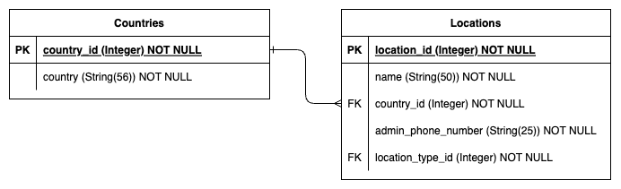
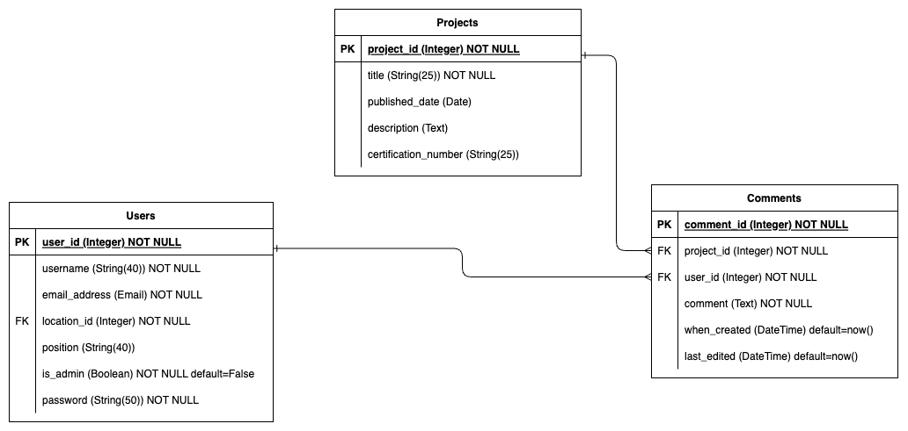
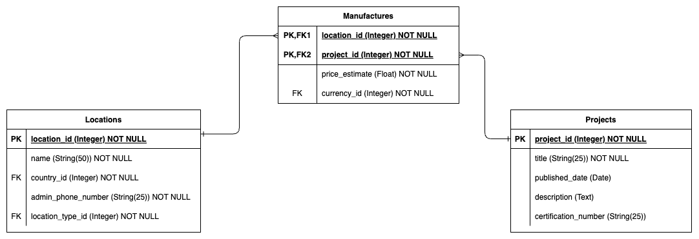

# T2A2 - API Webserver Project

### Kiran Warren

## Fabrication Projects Catalogue API

## Contents

- [1 Project Description](README.md#1-project-description-r1-r2)
  - [1.1 RDBMS Chosen - Postgres](README.md#11-rdbms-chosen---postgres-r3)
  - [1.2 ORM Chosen - SQLAlchemy](README.md#12-orm-chosen---sqlalchemy-r4)
- [2 Database Design](README.md#2-database-design)
  - [2.1 Entity Relation Diagram](README.md#21-entity-relation-diagram-r6)
  - [2.2 Entities and their Attributes](README.md#22-entities-and-their-attributes)
  - [2.3 Entity Relationships](README.md#23-entity-relationships-r8)
- [3 Application Design](README.md#3-application-design)
  - [3.1 API Endpoints](README.md#31-api-endpoints-r5)
  - [3.2 Third-Party Sevices](README.md#32-third-party-services-r7)
- [4 Project Management](README.md#4-project-management)

## 1 Project Description (R1, R2)

The topic chosen for this assignment is an API webserver designed to store and display information relating to a business' fabrication capabilities. This comes from personal experience working in an organisation with many locations of business, with each location having different a purpose and varying functionalities. Some locations are support offices, others are support workshops, some of rehabilitation projects, and most are mine sites. Operations are also multinational, with locations across Australia, Indonesia, Chile, India, Canada and the US.

Different locations are naturally siloed to some extent, and it is not possible to know what engineering projects have been completed at other locations without aimlessly calling/emailing around to contacts around the business. The aim of this project is to provide a platform to facilitate information sharing between locations. Fabrication projects will be catalogued in this database, and users will be able to see what projects have been designed internally and what workshops offer to fabricate them. For this application, a fabrication project would refer to a fabricated solution to a problem designed by an engineer, e.g. a transport frame, or a lifting tool, or a bespoke work platform, etc. Some example uses for this application include:

- A team of asset specialists working on a scope to deploy 12 x new CAT 789C trucks to a mine site. These trucks will need consist works completed before they can be handed over to operations. This application will provide a quick solution to see what consist has been designed internally. They can also see which internal workshops are willing to fabricate these projects, so they can contact them ahead of time and get the projects in the works before the trucks arrive. Price estimates for the consist work are provided, allowing the team of asset specialists to add these figures to the fleet mobilisation budget.
- A maintenance superintendent has a failed CAT 793D transmission on his hands and needs to send it offsite for repair, however, his mine site does not have any transport frames that are certified to transport the 2 tonne component. By searching the available projects in this application, the superintendent sees that a support workshop has designed a certified transport frame for this purpose. She can retrieve all of the associated drawing numbers for this project and request them from the contact at the support workshop. She gives the drawings to a local engineering shop to have the frame fabricated.
- An engineer at a support workshop has been tasked with designing a tool to help install CAT 777F rear wheel groups. Before starting the project, the engineer quickly checks the application to see if this problem has already been solved elsewhere in the business. They see that an Indonesian workshop has done just that, so they request all associated drawings for this project from the Indonesian workshop. They send all drawings off to a consultancy for certification to Australian standards, and make all necessary changes to ensure that it meets standards. They can now add this project to the application, as it has been modified to meet Australian standards and will have different certification documents.

The information sharing provided by this application would save time and resources. Operational workers on mine sites would be given a clearer picture of what is internally available and who can make it for them. Engineers tasked with designing projects could utilise solutions that have been designed elsewhere in the business, instead of wasting time reinventing the wheel. It would work towards breaking down the information siloing between locations and pool the resources of the entire organisation. Additionally, it would help keep money in the business--why pay a third party $36,000 to design and fabricate something when you can see that a sister workshop has already designed a solution to your problem, and offer to build it for only $12,500?

### 1.1 RDBMS Chosen - Postgres (R3)

This project will use a relational database to store all information relating to the fabrication projects. The relational database management system that will be used if PostgreSQL. The reasons for choosing this RDBMS over others include:

- Postgres is open source.
-

### 1.2 ORM Chosen - SQLAlchemy (R4)

SQLAlchemy is an Object-Relational Mapper that automates the transfer of data between the PostgreSQL database tables and Python objects. It acts as a bridge between the database and the Python code. Instead of needing to write SQL statements to create/read/update/delete data in the database, Python code can be used instead. This makes it much easier to develop an API webserver, particularly for a beginner, where everything can just be written in the one programming language.

Along with the SQLAlchemy ORM and the PostgreSQL RDBMS, this project will also utilise the following web framework and db connector:

- Flask:
- psycopg:

## 2 Database Design

### 2.1 Entity Relation Diagram (R6)

### 2.2 Data Tables

The database will have the following 9 data tables:

- <b>Locations</b> - This table will store information regarding business locations. For normalisation, two supporting tables have been created for the Locations table:
  - <b>Countries</b> - List of the countries that the business has locations inn
  - <b>Location Types</b> - List of location types, e.g. head office or support workshop.
- <b>Users</b> - This table will store information on all users of the API webserver.
- <b>Projects</b> - This table will store information on fabrication projects.
- <b>Drawings</b> - This table will store information on all drawings relating to all fabrication projects.
- <b>Comments</b> - This table will store comments that users have made on projects. Many users could comment on many projects, so the Comments junction table has been created to simplify the many-to-many relationship.
- <b>Manufactures</b> - This table will store information regarding what locations can manufacture which projects. One row of this table represents a location offering to manufacture a project. Many locations could manufacture many projects, so the Manufactures junction table was created to resolve this. There should be no duplication of rows containing the same location and project information, so a composite key will be used to ensure unique combinations of location-project. For normalisation, a single supporting table was created for the Manufactures table:
  - <b>Currencies</b> - List of all currency abbreviations that may be used, e.g. AUD, IDR, USD, etc.

### 2.3 Relationships (R9)

There are a total of 10 relationships between tables in the database. These have been described in finer detail below.

- Countries - Locations
  There is a one-to-many relationship between countries and business locations. A single country could have many business locations. A single business location will be located in the one country.

- Location Types - Locations
  There is a one-to-many relationship between location types and locations. There could be many locations that have the same location type. However, a single location will be a single location type.

- Locations - Users
  There is a one-to-many relationship between locations and users. Multiple users could exist at the same location. A user will have a single place of work (location).

- Users - Projects
  There is a one-to-many relationship between users and projects. A user referenced as a project's attribute will be the designer of the project or the project's owner. A single user could own/design many projects, but a project will have only one owner.

- Projects - Drawings
  There is a one-to-many relationship between projects and drawings. A single project will typically consist of many individual drawings, including assembly drawings and part drawings. A drawing will be associated to a single project.

- Users - Comments - Projects
  The application is to include functionality to allow users to post comments on projects. This would be a many-to-many relationship between users and projects. Many users could comment on a single project. A single user could comment on multiple projects, and could even comment on a single project multiple times. In order to resolve this relationship, a comments table was created to be a junction table between users and projects. This creates two relationship; a one-to-many relationship between users and comments, and a one-to-many relationship between projects and comments.

- Locations - Manufactures - Projects
  The application will provide information about which internal workshops offer to fabricate particular projects, and for what price. A single workshop could manufacture multiple projects. A single project could be manufactured by multiple workshops. To resolve this many-to-many relationship between locations and projects, the manufactures junction table was created. This creates two relationships; a one-to-many relationship between locations and manufacture offerings, and a one-to-many relationship between projects and manufacture offerings. It is also important to note that the combination of location/project references in the manufactures table needs to be unique. There cannot be two rows in the manufactures table detailing a location manufacturing a project for two different prices--this would not be normalised. To correct this, the location and project ID foreign keys will be used as a composite key in the manufactures table.

- Currencies - Manufactures
  There is a one-to-many relationship between currencies and manufacturing offerings. A location will offer to manufacture a project at a listed price of a single currency. Many manufacturing offerings can be listed with the same currency.

## 3 Application Design

### 3.1 API Endpoints (R5)

The application shall have the following endpoints:

### 3.1.1 Homepage

> GET /

Homepage for the application. Displays all available endpoints.

Responses:

- 200 OK

### 3.1.2 Location Endpoints

### Get all locations

> GET /locations

Returns all business locations stored in the database.

Responses:

- 200 OK

### Get location by location ID

> GET /location/{id}

Returns the location that matches the given _id_.

Responses:

- 200 OK,
- 404 Not Found - a location with that _id_ does not exist in the locations data table.

Parameters:

- id: Integer, Required

### Create a location

> PUT /locations

Creates a location in the locations data table using the HTTP payload.

Responses:

- 201 Created
- 400 Bad Request - the put operation was not completed, please check to see your payload matches the parameter requirements.

Parameters:

- name: String(50), Required
- country_id: Integer, Required
- admin_phone_number: String(25), Required
- location_type_id: Integer, Required

### Modify a location by location ID

> PUT /location/{id}

Modifies the location in the locations data table that has a matching _id_.

Responses:

- 200 OK
- 400 Bad Request - the put operation was not completed. please check to see your payload matches the parameter requirements.

Parameters:

- name: String(50), Optional
- country_id: Integer, Optional
- admin_phone_number: String(25), Optional
- location_type_id: Integer, Optional

### 3.2 Third-Party Services (R7)

## 4 Project Management
